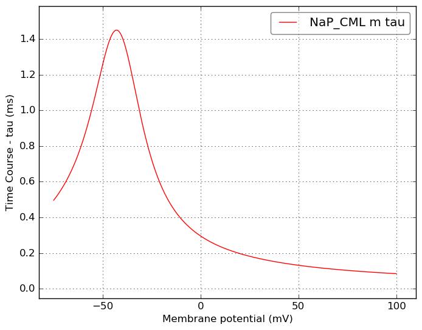
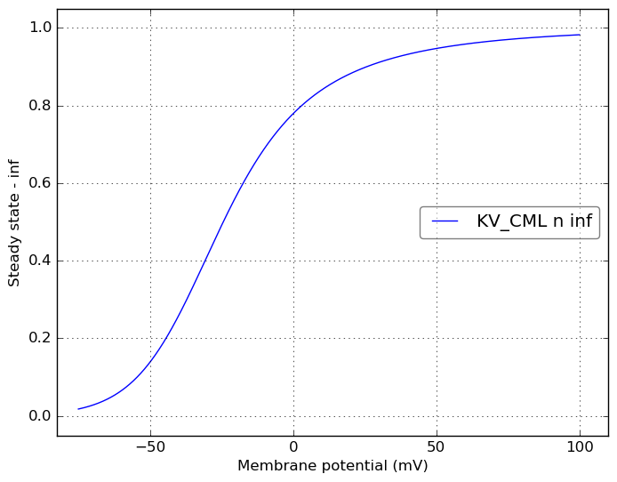

Channel information
===================
    

Channel information at: T = 23.0 degC, E_rev = 0 mV, [Ca2+] = 0.00043 mM

<table>
    <tr>
<td width="120px">
            <b>NaP_CML</b> 
            <a href="../NaP_CML.channel.nml">NaP_CML.channel.nml</a> 
            <b>Ion: na</b> 
            <i>g = gmax * m </i> 
            Persistent Na+ channel
</td>
<td>

</td>
<td>

</td>
</tr>
    <tr>
<td width="120px">
            <b>KV_CML</b> 
            <a href="../KV_CML.channel.nml">KV_CML.channel.nml</a> 
            <b>Ion: k</b> 
            <i>g = gmax * n4 </i> 
            Delayed rectifier K+ channel, based on mod file supplied with Solinas et al 2007 (ModelDB 112685)
</td>
<td>

</td>
<td>

</td>
</tr>
    <tr>
<td width="120px">
            <b>Kslow_CML</b> 
            <a href="../Kslow_CML.channel.nml">Kslow_CML.channel.nml</a> 
            <b>Ion: k</b> 
            <i>g = gmax * n </i> 
            A slow M-like K+ channel, based on mod file supplied with Solinas et al 2007 (ModelDB 112685)
</td>
<td>

</td>
<td>

</td>
</tr>
</table>

